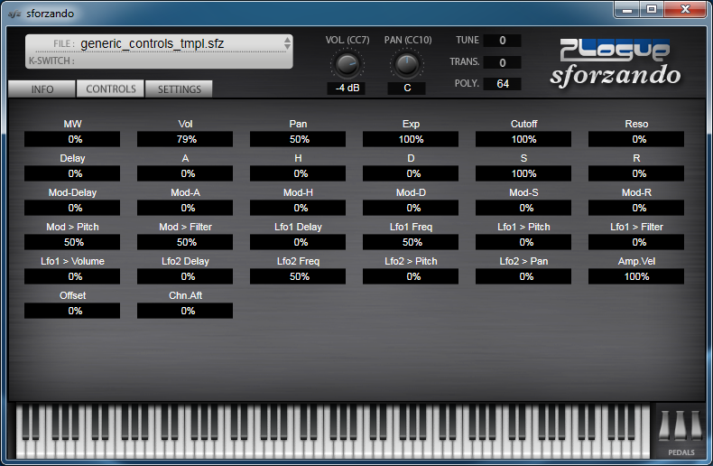
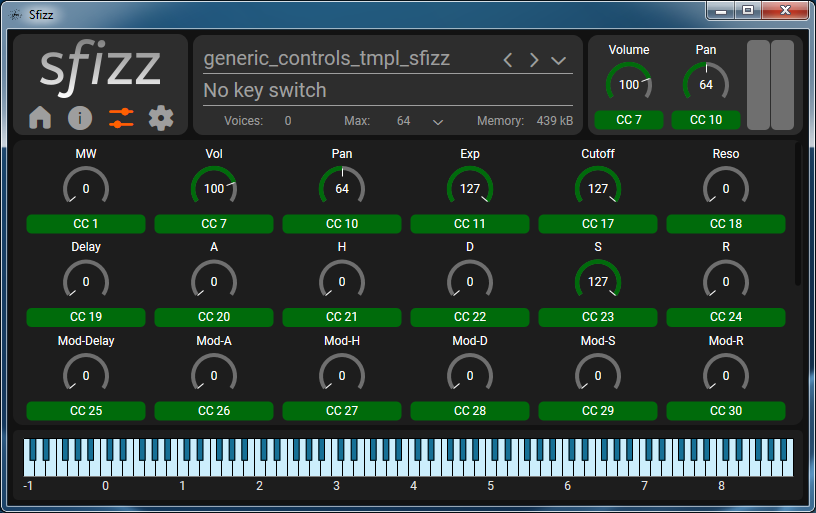
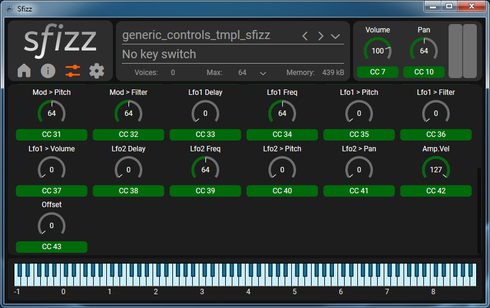

# About :
Generic template for quickly shown functioning standard-style controls on sforzando and sfizz UI.
Put your regions at the bottom of this template or use it as #include for multiple sfz presets.
Adjust set cc values to match your own presets.
MIDI CC used number starts from CC17 and so on.
Default filter type is Lowpass 2-Pole.
Envelope Delay range 5 seconds.
Envelope Attack range 10 seconds.
Envelope Hold range 10 seconds.
Envelope Decay range 50 seconds.
Envelope Sustain is 100%
Envelope Release range 50 seconds.
Change anything to suits your workflow.

# Notes :
Maximum default filter cutoff setting at 100%in sforzando is not fully open at 20kHz.
So if you don't want to use the filter, you can just commented out the filter opcode.
Like this : //cutoff=20
At this time of writing, there is a limitation in sfizz for the `ampeg_sustain_oncc`, so there is a separate version for sfizz.

# License :
None, free to use.

  
  
  
